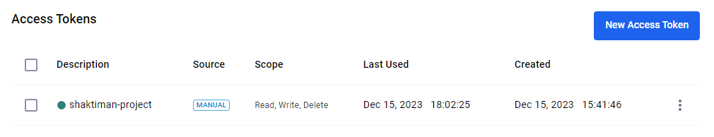
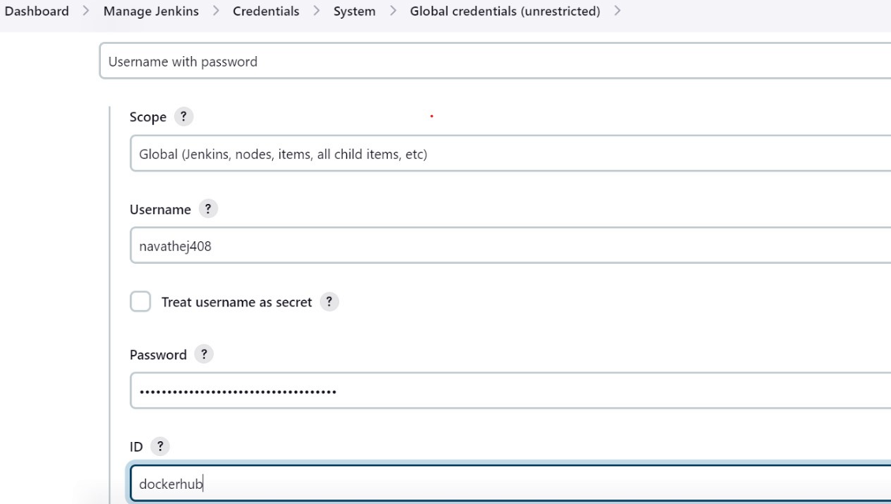
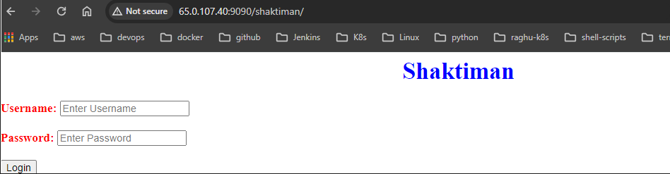
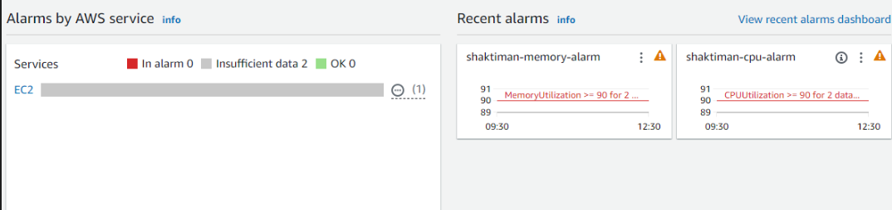

# Infrastrucher setup using terraform for Shaktiman Project
- Generate token in dockerhub

- Add docker token in jenkins credentials as dockerhub as id and then use dockerhub in environment variabels in jenkins file  
    

1. setup providers information

        provider "aws" {
            region                   = "ap-south-1"
            shared_credentials_files = ["/Users/DELL/.aws/credentials"]
        }

2. creating security group for ssh 22 and shaktiman web access 9090 

        resource "aws_security_group" "sg-1" {
            name        = "shaktiman-sg"
            description = "Allow Inbound Traffic"

            ingress {
                description = "SSH"
                from_port   = "22"
                to_port     = "22"
                protocol    = "tcp"
                cidr_blocks = ["0.0.0.0/0"]
            }

            ingress {
                description = "shaktiman_web_access"
                from_port   = "9090"
                to_port     = "9090"
                protocol    = "tcp"
                cidr_blocks = ["0.0.0.0/0"]
            }

            egress {
                from_port   = "0"
                to_port     = "0"
                protocol    = "-1"
                cidr_blocks = ["0.0.0.0/0"]
            }

            tags = {
                Name = "Shaktiman_Web_Access"
            }
        }

3. setup keypair to access machine

        resource "aws_key_pair" "myec2-key" {
            key_name   = "shaktiman-key"
            public_key = ""
        }

4. setup docker machine and setup shaktiman container 

        resource "aws_instance" "myec2" {
            ami                    = "ami-0287a05f0ef0e9d9a"
            instance_type          = "t2.micro"
            key_name               = "shaktiman-key"
            vpc_security_group_ids = [aws_security_group.sg-1.id]
            user_data              = <<-EOF
                            #!/bin/bash
                            sudo apt update -y
                            sudo curl -fsSL https://get.docker.com -o docker.sh
                            sudo sh docker.sh
                            sudo docker pull navathej408/shaktiman:latest
                            sudo docker run --name shaktiman -d -p 9090:8080 navathej408/shaktiman:latest
                        EOF

            tags = {
                Name = "Docker-Machine"
            }
        }

5. setup cloudwatch for monitor machine CPU and Memory

        resource "aws_cloudwatch_metric_alarm" "shaktiman-cpu-alarm" {
            alarm_name          = "shaktiman-cpu-alarm"
            comparison_operator = "GreaterThanOrEqualToThreshold"
            evaluation_periods  = "2"
            metric_name         = "CPUUtilization"
            namespace           = "AWS/EC2"
            period              = "300"
            statistic           = "Average"
            threshold           = "90"
            actions_enabled     = false 
            alarm_description   = "Alarm when CPU exceeds 90% for 2 consecutive periods"
        }

        resource "aws_cloudwatch_metric_alarm" "shaktiman-memory-alarm" {
            alarm_name          = "shaktiman-memory-alarm"
            comparison_operator = "GreaterThanOrEqualToThreshold"
            evaluation_periods  = "2"
            metric_name         = "MemoryUtilization"
            namespace           = "System/Linux"
            period              = "300"
            statistic           = "Average"
            threshold           = "90"
            actions_enabled     = false 
            alarm_description   = "Alarm when Memory exceeds 90% for 2 consecutive periods"
        }

