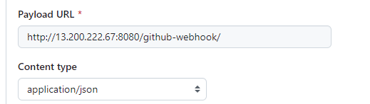

# Create CI-CD Pipeline for to setup shaktiman web application 

- setup jenkins machine (t2.medium)
 - setup webhook integration for automatic build triggers with SCM 
    
    

 - install docker in the jenkins machine  
 - add jenkins user into docker group for docker commands to run 
    
        $ sudo usermod -a -G docker jenkins

# jenkins file code steps

1. To build pipeline code if we have any agent machine we need to include here To build job From agent mahine

        pipeline{
            agent any
        }

2. To pass environment variables 

        environment {
            APP_NAME = "shaktiman"
            RELEASE = "1.0.0"
            DOCKER_USER = "navathej408"
            DOCKER_PASS = 'dockerhub'
            IMAGE_NAME = "${DOCKER_USER}" + "/" + "${APP_NAME}"
            IMAGE_TAG = "${RELEASE}-${BUILD_NUMBER}"
        }

3. To clean workspace 

        stage("Clear Workspace"){
            steps{
                cleanWs()
            }
        }

4. Download code from Repo 

        stage ("Downlod Code") {
            steps {
                git 'https://github.com/thej950/shaktiman.git'
            }
        }

5. Build code using maven 

        stage ("Build Code") {
            steps {
                sh 'mvn package'
            }
        }

6. To Build Docker image and push into docker hub using environments 
 - For this steps we need to install some plugins which required for docker
   
   1. Plugins

   docker, docker commons, docker pipeline, dokcer api, docker build step, cloud bees docker build and publish

   2. Now generate Token from dockerhub store into jenkins credetials with name as "dockerhub"  

  
            stage ("Build Docker image and Push into dockerhub") {
                steps {
                    script {
                        docker.withRegistry('',DOCKER_PASS){
                            docker_image = docker.build "${IMAGE_NAME}"
                        }
                        docker.withRegistry('',DOCKER_PASS){
                            docker_image.push("${IMAGE_TAG}")
                            docker_image.push('latest')
                        }
                    }
                }
            }

> After Complet above step Image will be uploaded into Dockerhub

