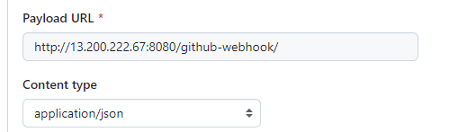
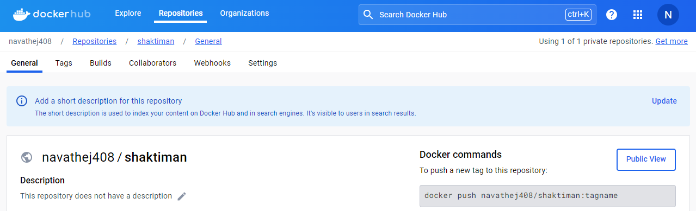

# Build CI/CD Pipeline using Jenkins to Deploy a Web Application on AWS

## Technologies Used:
- **Jenkins**
- **Groovy**
- **AWS Cloud**
- **Git**
- **Docker**  

---

## **Pre-Requisites:**
1. **Setup Jenkins** on an **Ubuntu t2.large** instance.
2. **Integrate Webhook** for automatic build triggers.
3. **Create an IAM Role** (`ecr_role1`) with **AdministratorAccess** and attach it to the Jenkins machine.
4. **Create an ECR Repository** in the same AWS region where the Jenkins machine is running to store Docker images.

---

## **Jenkins Pipeline Code (Jenkinsfile):**

### **Step 1: Define Pipeline & Build Agent**
```groovy
pipeline {
    agent any
```

### **Step 2: Define Environment Variables**
```groovy
environment {
    APP_NAME = "myapp"
    ECR_REGISTRY = "115498080659.dkr.ecr.us-east-1.amazonaws.com"
    ECR_REPOSITORY = "thej"
    IMAGE_NAME = "${APP_NAME}"
    BUILD_VERSION = getVersion()
}
```

### **Step 3: Clean Workspace**
```groovy
stage("Clear Workspace") {
    steps {
        cleanWs()
    }
}
```

### **Step 4: Download Code from Repository**
```groovy
stage("Download Code") {
    steps {
        git 'https://github.com/thej950/project-1.git'
    }
}
```

### **Step 5: Build and Test Application**
```groovy
stage("Test Application") {
    steps {
        sh 'mvn test'
    }
}

stage("Build Application Code") {
    steps {
        sh 'mvn package'
    }
}
```

### **Step 6: Install and Configure Docker**
```bash
# Install Docker
sudo curl -fsSL https://get.docker.com -o docker.sh
sh docker.sh

# Add Jenkins user to Docker group
sudo usermod -aG docker jenkins

# Grant Jenkins sudo access without password prompt
sudo usermod -aG sudo jenkins
vim /etc/sudoers  # Add: jenkins ALL=(ALL) NOPASSWD:ALL
```

### **Step 7: Build Docker Image**
```groovy
stage("Build Docker Image") {
    steps {
        sh "docker build -t $APP_NAME:$BUILD_VERSION ."
    }
}
```

### **Step 8: Push Docker Image to AWS ECR**
```groovy
stage("Push Docker Image to ECR") {
    steps {
        script {
            sh "aws ecr get-login-password --region us-east-1 | docker login --username AWS --password-stdin ${ECR_REGISTRY}"
            sh "docker tag $APP_NAME:$BUILD_VERSION $ECR_REGISTRY/$ECR_REPOSITORY:$BUILD_VERSION"
            sh "docker push $ECR_REGISTRY/$ECR_REPOSITORY:$BUILD_VERSION"
        }
    }
}
```

### **Step 9: Clean Up Docker Images Locally**
```groovy
stage("Clear Docker Images Locally") {
    steps {
        sh 'docker system prune -af'
    }
}
```

### **Step 10: Pull ECR Image to Local Machine**
```bash
# Authenticate and Pull Image
aws ecr get-login-password --region us-east-1 | docker login --username AWS --password-stdin ${ECR_REGISTRY}
docker pull $ECR_REGISTRY/$ECR_REPOSITORY:$BUILD_VERSION
```

### **Step 11: Stop Previous Containers (If Running)**
```groovy
stage("Stop Previous Containers") {
    steps {
        script {
            sh 'ssh ubuntu@54.234.168.231 docker rm -f myappcontainer'
        }
    }
}
```

### **Step 12: Deploy and Run Docker Container**
```groovy
stage("Run Docker Image") {
    steps {
        sh "ssh ubuntu@54.234.168.231 docker run --name myappcontainer -d -p 9090:8080 $ECR_REGISTRY/$ECR_REPOSITORY:$BUILD_VERSION"
    }
}
```

### **Step 13: Email Notification Setup**
```groovy
post {
    success {
        mail to: 'goudc423@gmail.com', subject: 'Project Completed Successfully', body: 'CI/CD Pipeline executed successfully.'
        echo "Project completed successfully."
    }
    failure {
        mail to: 'goudc423@gmail.com', subject: 'Project Failed', body: 'CI/CD Pipeline execution failed.'
        echo "Project failed."
    }
}
```

### **Step 14: Function to Generate Build Version**
```groovy
def getVersion() {
    def buildNumber = env.BUILD_NUMBER ?: '0'
    return "1.0.${buildNumber}"
}
```

---

## **Pipeline Overview:**
### **Stages in Jenkins Pipeline**


### **Gmail Notification Setup**


---

## **Summary**
This document provides a step-by-step guide to building a CI/CD pipeline using **Jenkins** and deploying a real-world web application in **AWS Cloud**. The pipeline integrates **Git, Docker, AWS ECR**, and automatic build triggers. Additionally, email notifications are configured to track success or failure. 🚀

