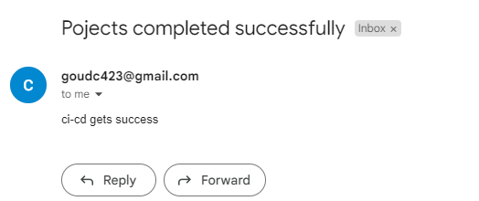

# Build CI / CD Pipeline using Jenkins and deploy the real world Web Application in AWS Cloud

Technologies Used:-
-------------------
1. Jenkins
2. Groovy
3. AWS Cloud
4. Git
5. Docker  

Pre-Requiset:
--------------
* Setup Jenkins (ubuntu with t2.large)
* setup webhook integration for automatic Build Triggers 
* Create A Role (name: ecr_role1 ) with AdministrationAccess  Attach to Jenkins Machine  
* Create ECR Repo in the same region where jenkins machine available For to upoad image into that repo 

jenkinsFile Code steps
-------------------------------
>step1: To build pipeline code if we have any agent machine we need to include here To build job From agent mahine 
   
    pipeline{
        agent any
    }

>step2: To Pass environments in jenkins

    environment {
        APP_NAME = "myapp"
        ECR_REGISTRY = "115498080659.dkr.ecr.us-east-1.amazonaws.com"
        ECR_REPOSITORY = "thej"
        IMAGE_NAME = "${APP_NAME}"
        BUILD_VERSION = getVersion()
    }
   

>step3: clean workspace 

        stage("Clear Workspace"){
            steps{
                cleanWs()
            }
        }

>step4: Download Code From Repo

        stage("Download Code"){
            steps{
                git 'https://github.com/thej950/project-1.git'
            }
        }

>step5: Build and test application code using maven 

        stage("Test Application"){
            steps{
                    sh 'mvn test'
            }
        }
        stage("Build Application Code"){
            steps{
                sh 'mvn package'
            }
        }

>step6: Build the Docker image 
    
* First Download Docker into Jenkins Machine for Building image from Dockerfile
       
        # sudo curl -fsSL https://get.docker/com -o docker.sh
        # sh docker.sh

* Add jenkins user into dokcer group to build docker images Directly 
        # sudo usermod -a -G docker jenkins
* Add jenkins user into sudo group for to run root commands also enter details of jenkins user in sudoers file To avoid to no to ask password [ jenkins ALL (ALL:ALL) NOPASSWD:ALL ]
       
        # sudo usermod -a -G sudo jenkins
        # vim /etc/sudoers
        
* To Build Docker image    
        
        stage("Build Docker image"){
            steps{
                 sh "docker build -t $APP_NAME:$BUILD_VERSION ."
            }
        }

>step7: To push Docker image into ECR repository 
* if Jenkins machine is avilable in AWS cloud Environment that machine need to Contain a Role with  AdministrationAccess and attach to jenkins machine  or create a user with specific policy which is  AmazoneEc2ContainerRegistryFullAccess For only specifically for ECR
* If Jenkins machine available In local environment then that machine Required a User (navathej) with AdministrationAccess  
* there are combinations of steps included here To push already existing dokcer image into ecr repository
* check ecr repo is avialabile if its not create first in AWS ECR service 
* take commands after creating ecr repo include into code to upload image into ecr repo 
* Below are jenkins code To upload image into ecr repo 

        stage("Push Docker image To ECR"){
            steps{
                script{
                    sh "aws ecr get-login-password --region us-east-1 | docker login --username AWS --password-stdin ${ECR_REGISTRY}"
                    sh "docker tag $APP_NAME:$BUILD_VERSION $ECR_REGISTRY/$ECR_REPOSITORY:$BUILD_VERSION"
                    sh "docker push $ECR_REGISTRY/$ECR_REPOSITORY:$BUILD_VERSION"
                }
            }
        }

>step8: Now clear images on jenkins machine 
        
        stage("Clear Docker images locally") {
            steps{
                sh 'docker system prune -af'
            }
        }

>step9: Now pull ECR image into local machine for this we need to login into ECR fist then perform to run image locally 

* setup Docker machine (specify security group in the inbound rules  ports ssh 22 port to only one specific machine IP , and specify  customised port 9090 To anyone to Access our webpage)
* Establish Password Less Authentication from Jenkins machine to Docker machine 
* include ubuntu user into docker group for to run docker commands 

* For this To create a role with AmazoneEc2ContainerRegistryFullAccess attached to ec2-instance or create a user with AmazoneEc2ContainerRegistryFullAccess Both will work 

* authenticate first To aws ecr For this machine need ECR permissions 

        # aws ecr get-login-password --region us-east-1 | docker login --username AWS --password-stdin ${ECR_REGISTRY}"

* pull image from ECR    

        # docker pull $ECR_REGISTRY/$ECR_REPOSITORY:$BUILD_VERSION

>step10: stop old contaiers if running with same name (myappcontainer)

        stage("stop previuos containers") {
            steps{
                script{ 
                    sh 'ssh ubuntu@54.234.168.231 docker rm -f myappcontainer'
                }
            }
        }

>step11: Now Run container 

        stage("Run Docker image") {
            steps{
                sh "ssh ubuntu@54.234.168.231 docker run --name myappcontainer -d -p 9090:8080 $ECR_REGISTRY/$ECR_REPOSITORY:$BUILD_VERSION"
            }
        }

>step12: setup To send Notification To gmail ( for this we need to setup smtp port in jenkins to perticular gmail )

* according below steps if all steps gets success it will send project success message or if any step gets fail it will failed project
* To setup mail configuration in jenkins follw this link: https://drive.google.com/file/d/1G2HGfoGKyv3pzB1eLnW8mVxaUeltqpZ1/view?usp=drive_link
 

        post {
            success {
                mail bcc: '', body: 'ci-cd gets success', cc: '', from: '', replyTo: '', subject: 'Pojects completed successfully', to: 'goudc423@gmail.com'
                echo "Project completed Successfully"
            }
            failure {
                mail bcc: '', body: 'failed ci-cd', cc: '', from: '', replyTo: '', subject: 'Pojects Failed', to: 'goudc423@gmail.com'
                echo "Project Failed"
            }
        }

>step13: specify function to trigger build versions images 

        def getVersion() {
            def buildNumber = env.BUILD_NUMBER ?: '0'
            return "1.0.${buildNumber}"
        }

# All stages 

# Gmail Notification 

